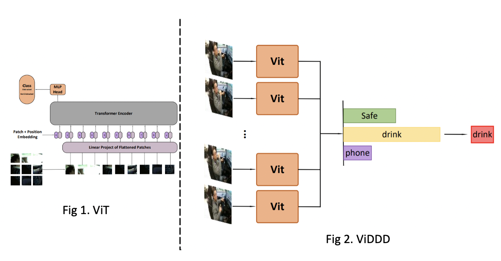
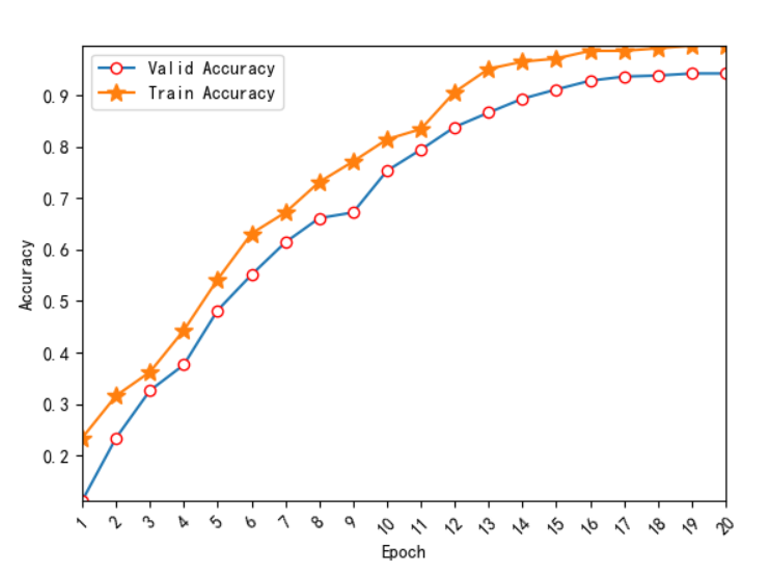
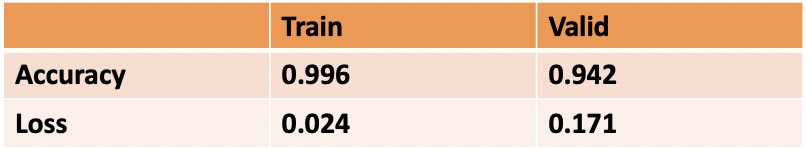
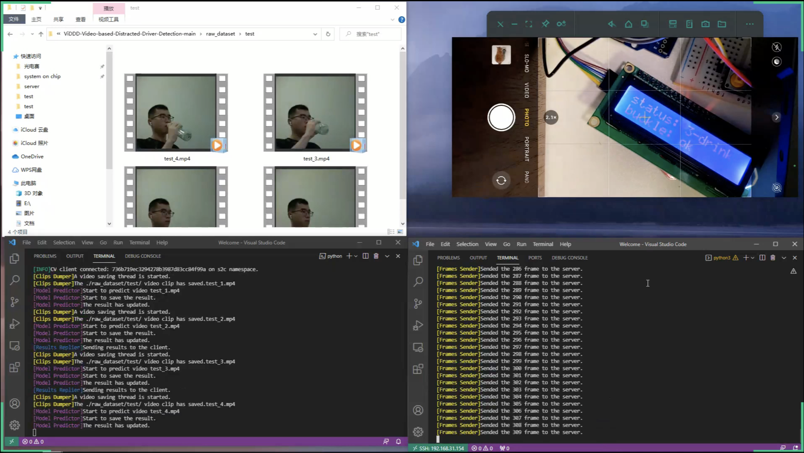

# Video-based Distracted Driver Detection System

## 驾驶行为分析及预警系统


## 1 Problem Description 问题阐述

### 1.1 Classification of dangerous driving behavior 危险驾驶行为分类

+ **Distracted driving 分心驾驶**
+ Fatigue driving 疲劳驾驶
+ Drunk driving 酗酒驾驶 
+ Aggression 路怒症
+ ...

### 1.2 Target Problems 存在的问题

1. A image-based detection scheme alone cannot accurately detect the leading actions of the driver's behavior, such as the driver reaching for the phone; and ignoring the whole action will lead to a decrease in recognition accuracy. **Although current image-based detection schemes have a high accuracy rate, they rely heavily on key frames and ignore other revelent actions of the driver.**

   仅基于图片的检测方案无法准确检测司机的行为的前导动作，如司机去拿手机；并且忽略动作的整体将导致识别准确率下降。尽管当前基于图片的检测方案已有较高的准确率，其十分依赖于关键帧，而忽略了司机的其他连贯动作。

2. Detection speed is an important indicator. Low time delay is required to to achieve real-time monitoring as much as possible.

   检测速度，低时延，尽量达到实时监测

### 1.3 Object 目标

 What we are going to do is distracted driver detection. On the embedded system side, we would use the camera to record the driver's behavior, and dump the video every 5s or 10s. Our current solution is to extract frames of this video under a proper time step in Raspberry Pi, and then send these packaged images to the server side as the raw input for the model prediction. The problem on this side is how to achieve a near real-time dectection. Because the Pi need to wait for the model's results and warn the driver through the buzzer.

<div align=center></div>


## 2 相关研究

### 2.1 分心驾驶数据集

1. AUC: https://abouelnaga.io/projects/auc-distracted-driver-dataset/ 

   The Distracted Driver’s dataset is collected using an ASUS ZenPhone (Model Z00UD) rear camera. The input was collected in a video format, and then, cut into individual images, 1080×19201080×1920 each. The phone was fixed using an arm strap to the car roof handle on top of the front passenger’s seat. In our use case, this setup proved to be very flexible as we needed to collect data in different vehicles. All of the distraction activities were performed without actual driving in a parking spot.

   Only images, 10 classes, haven't reply yet.

2. SEU: https://www.kaggle.com/c/state-farm-distracted-driver-detection/data 比赛数据集 10个类别 4GB

   Only images, 10 classes, 4GB

3. **DMD: https://dmd.vicomtech.org**

   Videos, 14 classes , 7GB

   For now, got the **lite version** of the database, which include 2446 70-frames clips.
   
   

### 2.2 动作识别数据集

1. ARID 暗场景下动作识别

   3784条video clips, 一共8721s，11 action classes.

### 2.3 Our Dataset (To be finished)

All in dark scene.

Classes: DMD + using phone fixed on the panel (watching short videos ~~or guided system~~ , ~~making calls~~,  operating(swipe and clike))

baseline: 8000 video clips, 15 people *  20 min

### 2.2 Rreference Papers 参考论文

+ transformer：

  [An Image is Worth 16x16 Words: Transformers for Image Recognition at Scale (2020 oct)](https://arxiv.org/abs/2010.11929)

  [ViViT: A Video Vision Transformer](https://arxiv.org/abs/2103.15691)

  https://www.jiqizhixin.com/articles/2020-10-05-4
  
  https://www.jiqizhixin.com/articles/2020-05-28-9?fbclid=IwAR3ZMsqDOk5MDBUaGREMEiEMd05ucDViOwALWxGjBgBwdbMeGvlCfKDximg

### 2.3 Others 其他

+ A repository contains different implementation of vit :

  https://github.com/lucidrains/vit-pytorch

## 3 Method 方法

### 3.1 Overall Ideas 

https://blog.qure.ai/notes/deep-learning-for-videos-action-recognition-review#sec-2

A Guide to Action Recognition (2018) :

+ **One network for capturing spatiotemporal information vs. two separate ones for each spatial and temporal**

  **使用一个网络来捕捉时空信息还是使用两个网络分别捕捉时间信息和空间信息**

+ **Fusing predictions across multiple clips**

  **多片段的融合预测**

+ **End-to-end training vs. feature extraction and classifying separately**

  **是端到端的训练还是特征提取与分类分开进行**

### 3.2 Vision Transformer model

In the ViDDD model, our input video intercepts 70 consecutive frames of pictures, and each image enters the same ViT model in sequence. For the 70 predicted values, we carry out simple statistics. Calculate the number of predictions for each model category. The largest category was then selected as the predicted result of the video.

<div align=center></div>

## 4 Communication Architecture

To bridge the deep learning side and embedded system side, we need to build a real-time communication system for video uploading and results feedback.

For real-time video uploading, on the client-side, camera capturers will continuously get frames from the camera embedded on the Pi. Frames senders are in charge of keeping sending frames to the server through the “video Steam sending” pipe. Once the frames reach the server-side, frames receivers will save them into a buffer. Every 70 frames in the buffer would be popped by clips dumper and write into a video clip. Model predictor would predict it and save the result to the Redis database.

At the same time, to obtain the results from the prediction model, result retrievers would query the server for the prediction results every 5s through the “Result Returning” pipe. Results replier on the server-side would look up in the database and return it.


## 5 Experiments

### 5.1 Dataset 数据集

+ Dataset Annotation 数据集标注

  We are so thankful to the video annotation tools provided by DMD.

  https://github.com/Vicomtech/DMD-Driver-Monitoring-Dataset/

  对于视频的处理使用FFmpeg或者OpenCV库，FFmpeg下载安装时记得让git走全局代理。

   <div align=center></div>
+ Process Raw Dataset

  - Cut the video into smaller clips containing 70 frames.
  - Label the each clip with the annotation file.
  - Restructure the folder


+ Data PreProcess

  for each frame in the clips:

  - Resize and Crop into 224*224 corresponding to the ViT expected input image size.
  - RandomHorizontalFlip
  - ToTensor
  - Normalize([0.5, 0.5, 0.5], [0.5, 0.5, 0.5])])

### 5.2 Model Evaluation


<div align=center></div>

<div align=center></div>

### 5.3 Experiments

<div align=center></div>

## 6 Code 目录结构

```
DDD
├── code
│   ├── __pycache__
│   │   └── mypath.cpython-38.pyc
│   ├── dataLoaders
│   │   ├── DMD-labels.json
│   │   ├── pic_dataset.py
│   │   └── video_dataset.py
│   ├── models
│   │   └── vit_base_patch16_224_in21k.pth
│   ├── mypath.py
│   ├── network
│   │   └── vit_model.py
│   ├── process_raw_dataset.py # processed raw dataset and save them into processed_dataset
│   ├── train.py
│   └── utils.py
|
|
├── data	# data ready for train
│   └── DMD-clips-70
│       ├── train
│       └── val
|
|
├── processed_dataset	# raw dataset after processed, but not ready for train
│   ├── DMD-clips-70
│   │   ├── change_gear
│   │   ├── drinking
│   │   ├── hair_and_makeup
│   │   ├── phonecall_left
│   │   ├── phonecall_right
│   │   ├── radio
│   │   ├── reach_backseat
│   │   ├── reach_side
│   │   ├── safe_drive
│   │   ├── standstill_or_waiting
│   │   ├── talking_to_passenger
│   │   ├── texting_left
│   │   ├── texting_right
│   │   └── unclassified
│   |
│   ├── driver_imgs_list.csv
│   └── imgs
│       └── train
...
```


